# lianjie
## homework5
### part1
为提高准度，使用手势指挥灯的亮灭
[代码位置: server](./11.14/task3/server.py)
[代码位置: client](./11.14/task3/client.py)
#### 效果

## homework4
[代码位置](./11.08/homework/homework.py)
定义了手势1为前进，手势2为后退，手势good为向右，手势5为向左
### 效果
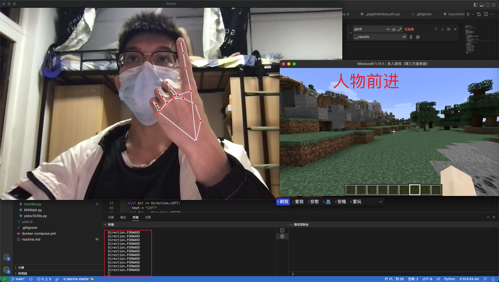
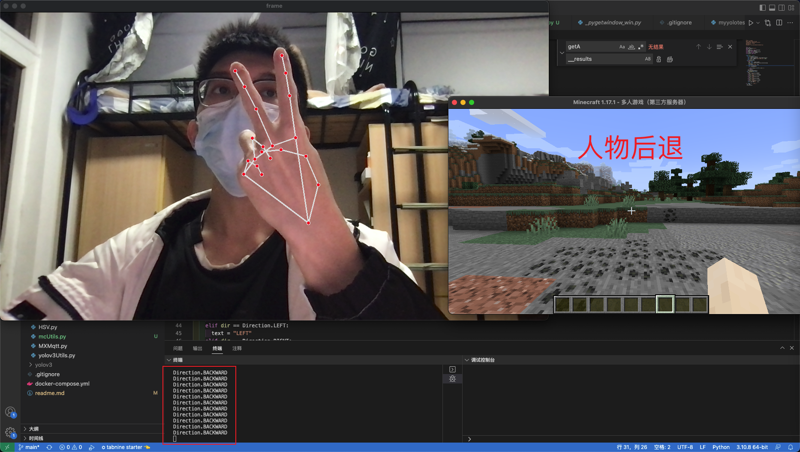
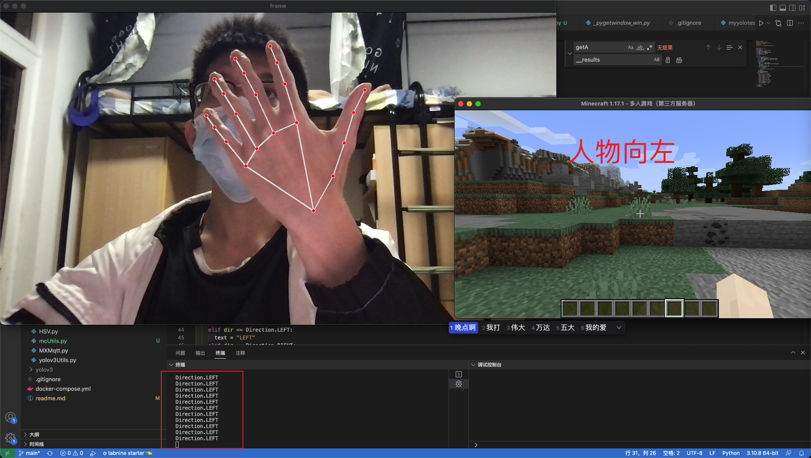
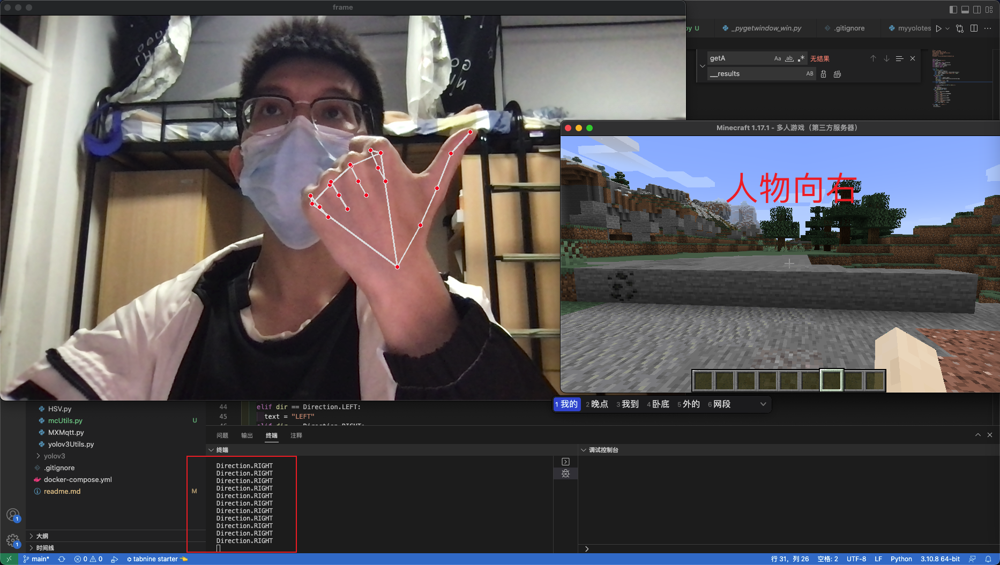
## homework3
[代码位置](./11.01/hw.py)
### 效果
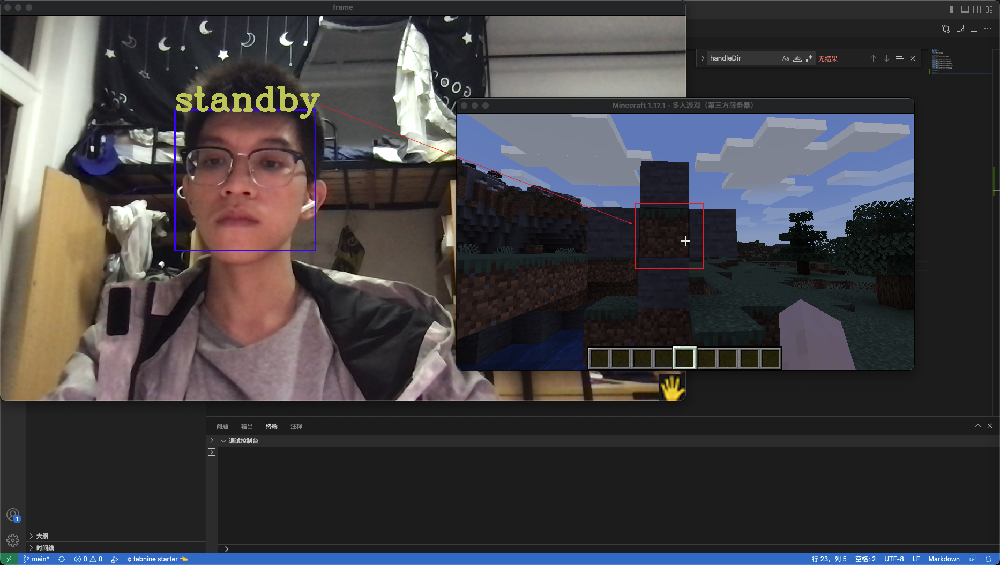
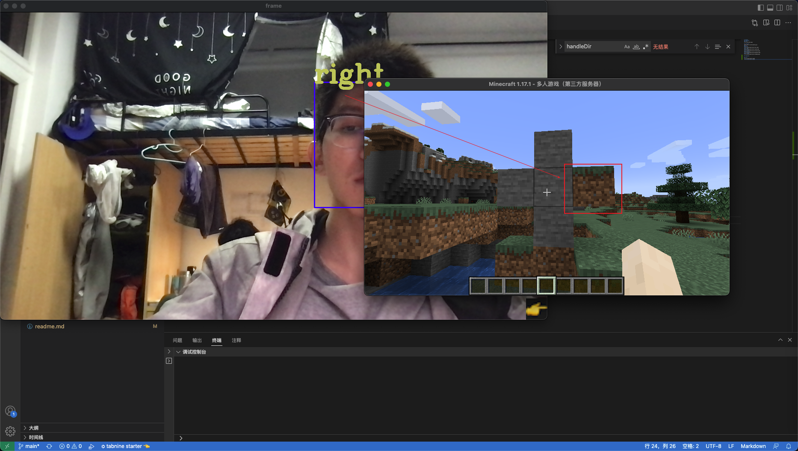
### 改进版：由于cv2的模型准确率太低，影响使用，改为使用mediapipe进行手部跟踪识别
[代码位置](./11.02/hwplus/hw.py)
#### 效果
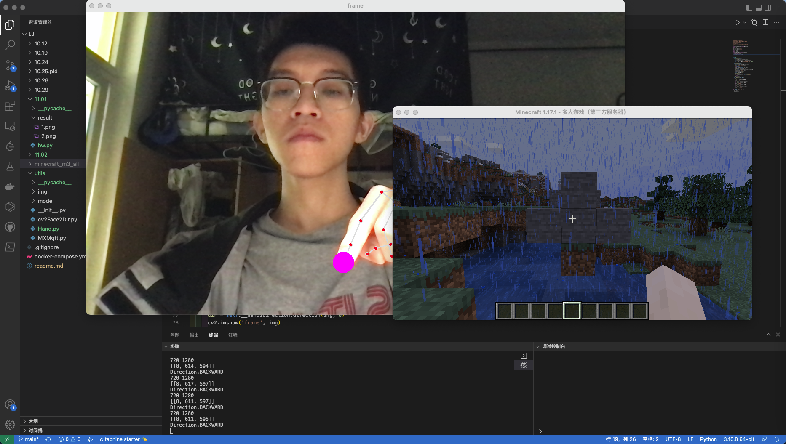
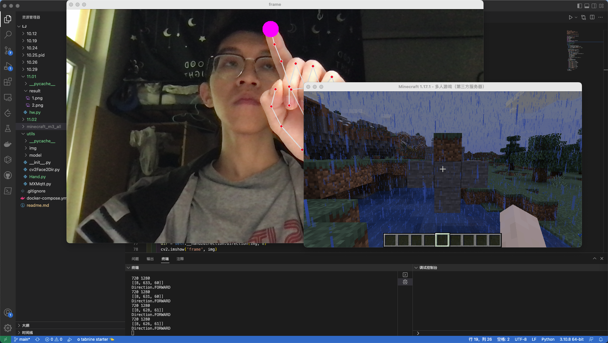
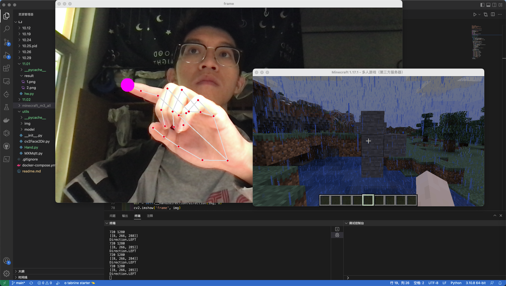
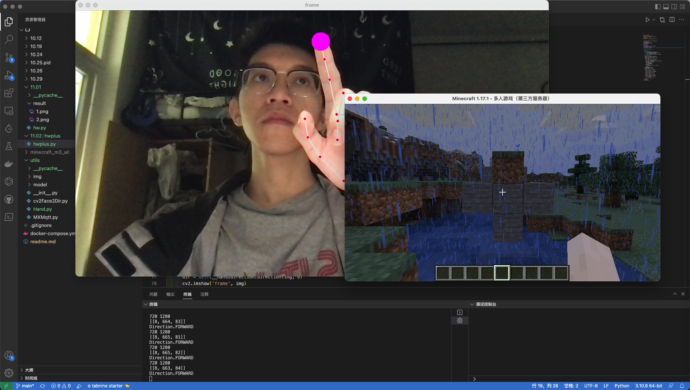
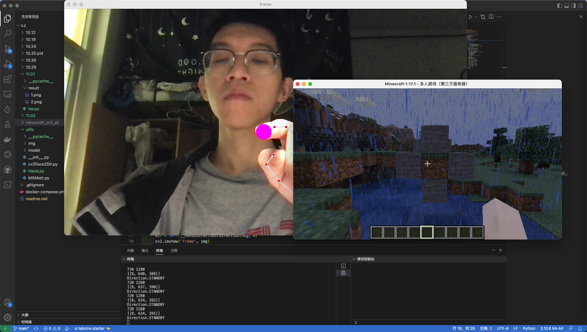

## homework2
[代码位置](./10.19/task5/op.py)
### 效果
#### left

#### right

#### forward

#### backward

#### standby

## homework1
### 效果
