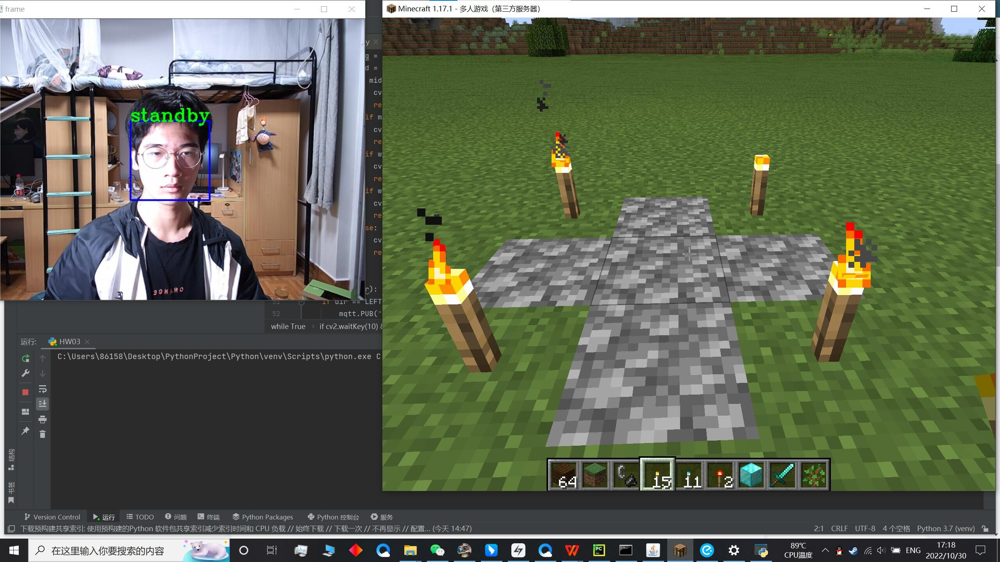
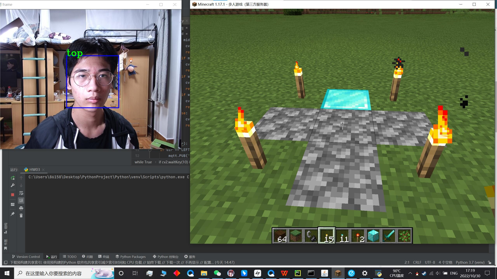
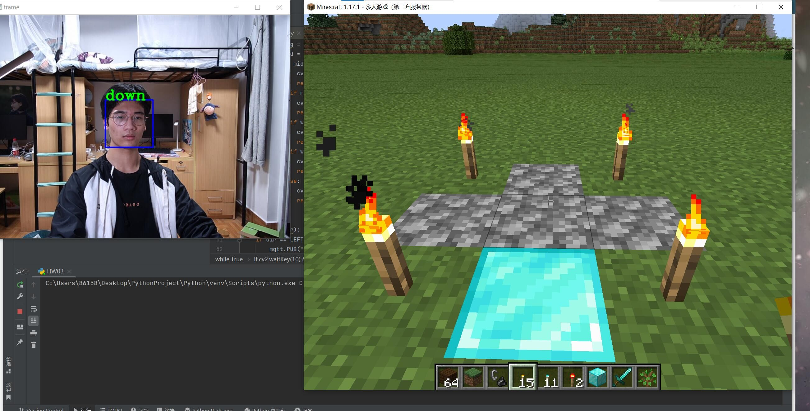
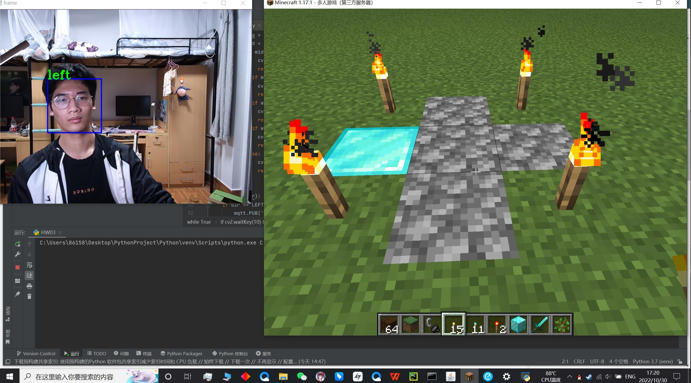
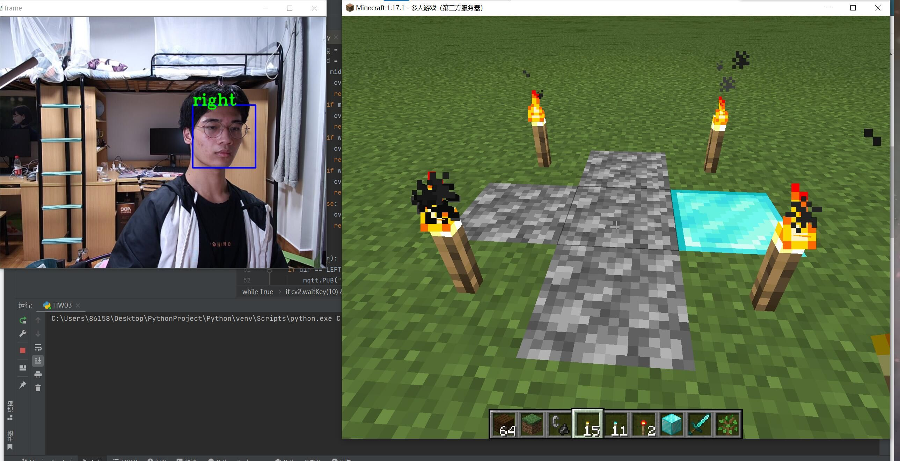
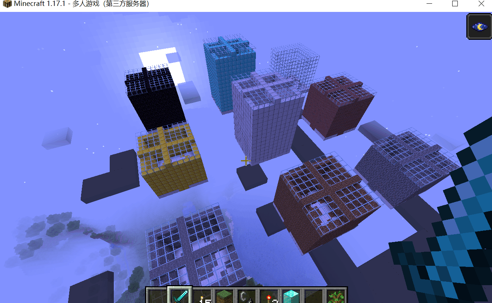
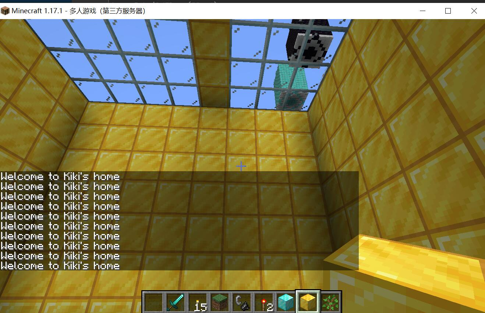

# Homework1
>利用双重for循环嵌套，将3行3列一共9个老虎头拷贝到图片左上角。并且每个老虎头外围都有一个绿色的矩形框环绕。
## 效果图
  

# Homework2
>根据代码中的 x y w h 参数， 设计一个规则能够利用人脸指挥前进后退，并添加可视化部分。

# Homework3
>用mc.setBlock函数摆一个十字架，用不同材质的方块表示灯的亮和不亮。 完成摄像头，人脸识别，mqtt远程指挥灯，我的世界数字孪生十字架同步的大整合。
## 效果图
### 都不亮

### 上方亮

### 下方亮

### 左边亮

### 右边亮
  

# Homework4
>利用mediapipe，定义上下左右几个手势，指挥我的世界玩家前后左右移动

# Homework5
>任务1：找一个灯泡的图片，用opencv画上下左右4个灯泡。连接到com13上作为命令接收方。 人脸检测作为发送方。 制作一个仿真的人脸识别通过串口控制上下左右4盏灯的仿真系统。  
>任务2：利用binvox命令，将你设计的3d物体的stl导入我的世界

# Homework6
>利用House类，建造3行3列9个房屋，让每个房子都有自己的名字，利用House类里面的isInHome函数，当玩家进入到某个屋子比如peter时，打印welcome to peter‘s home。  
## 效果图
### 建造3X3个房子
 
### 欢迎
 

