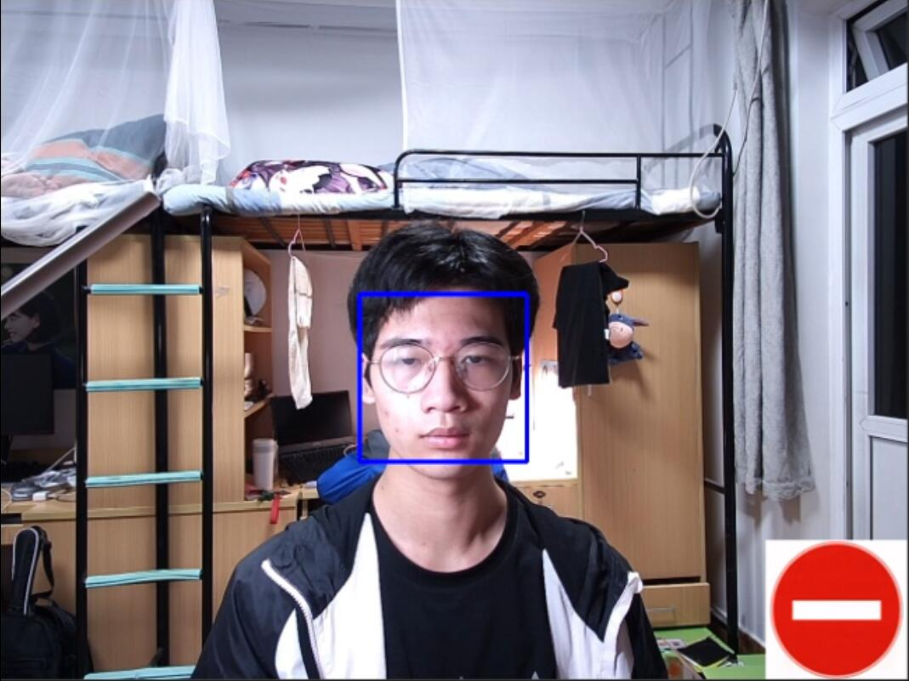
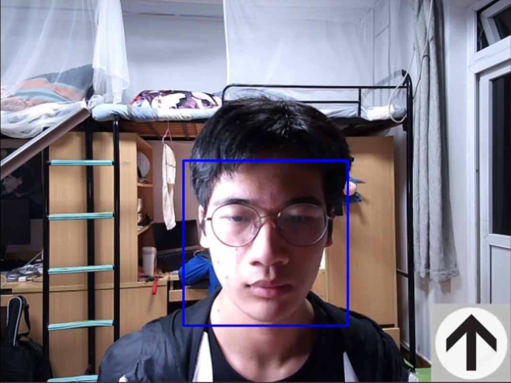
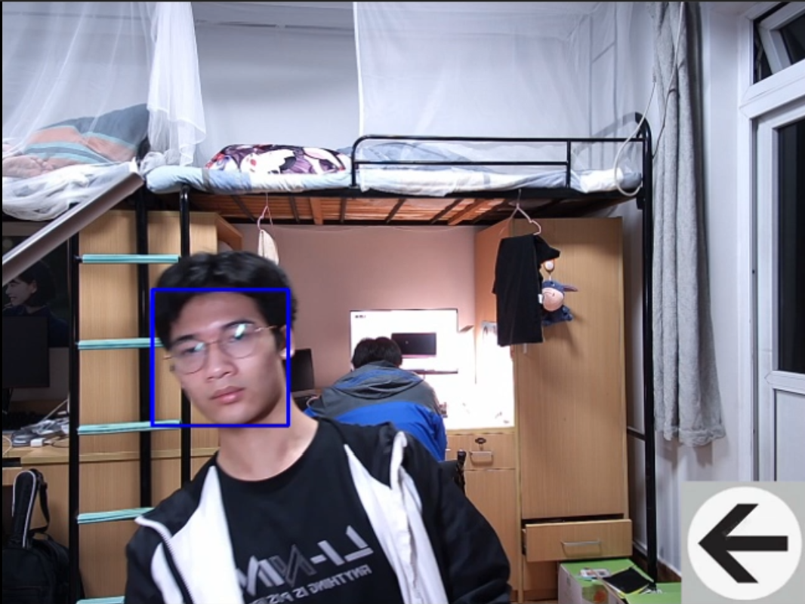
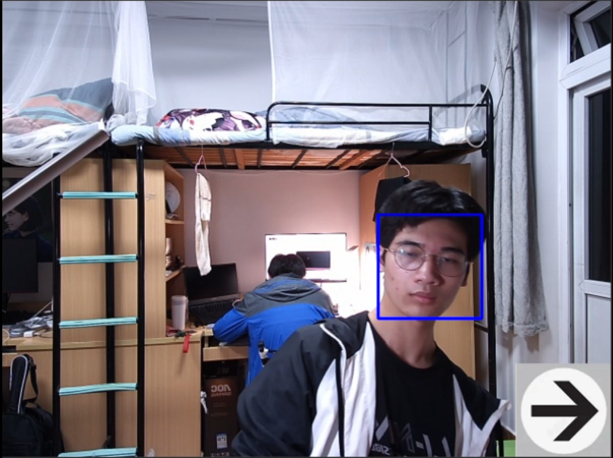
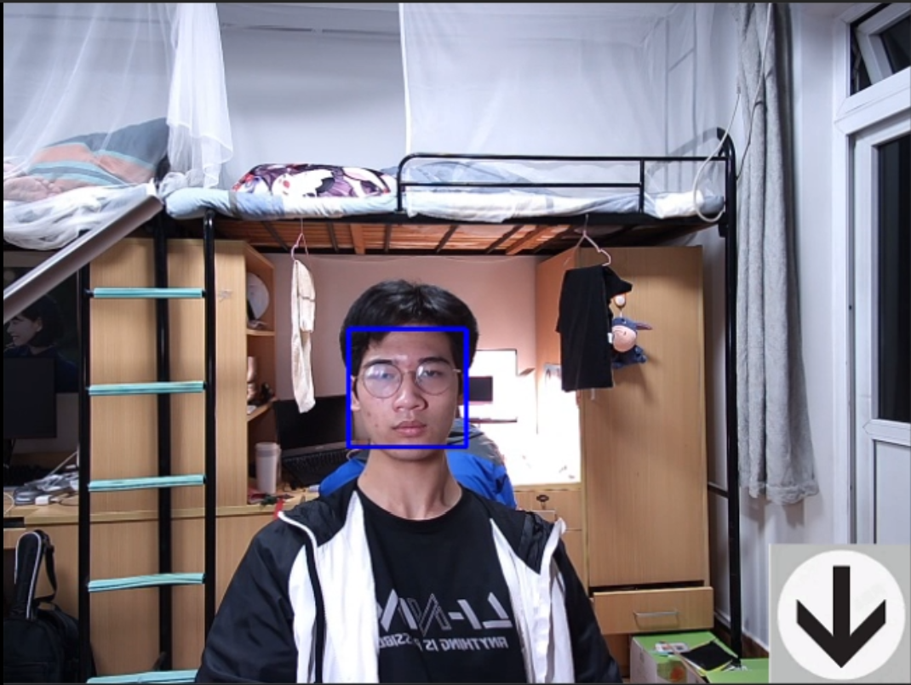

# Homework1
### 利用双重for循环嵌套，将3行3列一共9个老虎头拷贝到图片左上角。并且每个老虎头外围都有一个绿色的矩形框环绕。
## 效果图

# Homework2
### 根据代码中的 x y w h 参数， 设计一个规则能够利用人脸指挥前进后退，并添加可视化部分。
## 效果图
### 停止

### 前进

### 向左

### 向右

### 后退

# Homework3
### 用mc.setBlock函数摆一个十字架，用不同材质的方块表示灯的亮和不亮。 完成摄像头，人脸识别，mqtt远程指挥灯，我的世界数字孪生十字架同步的大整合。
## 效果图
### 
