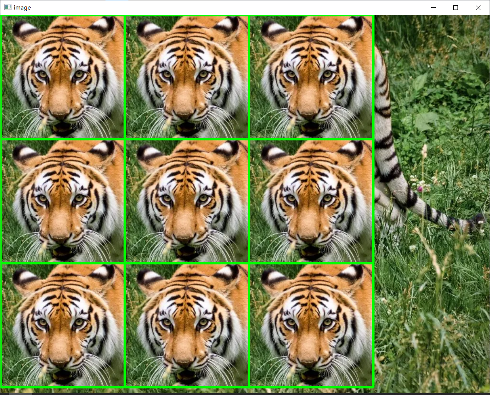
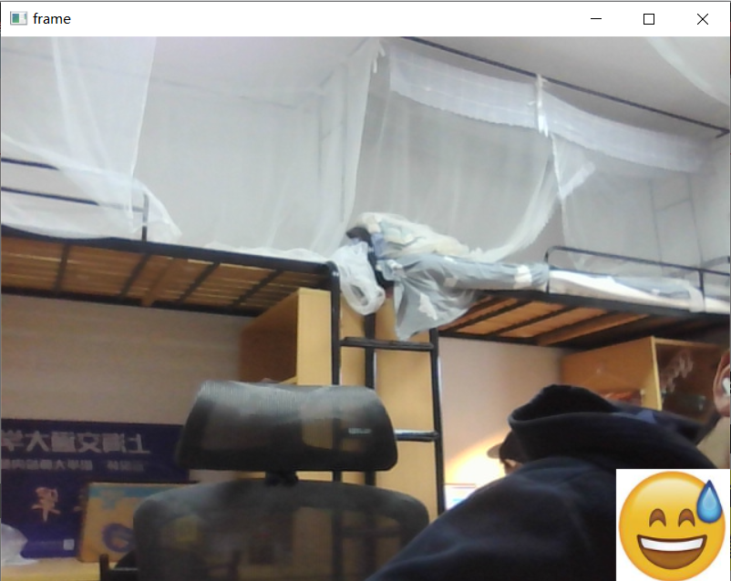
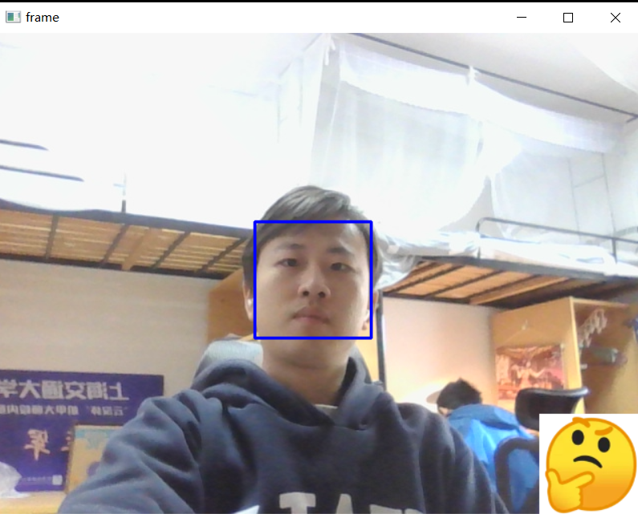
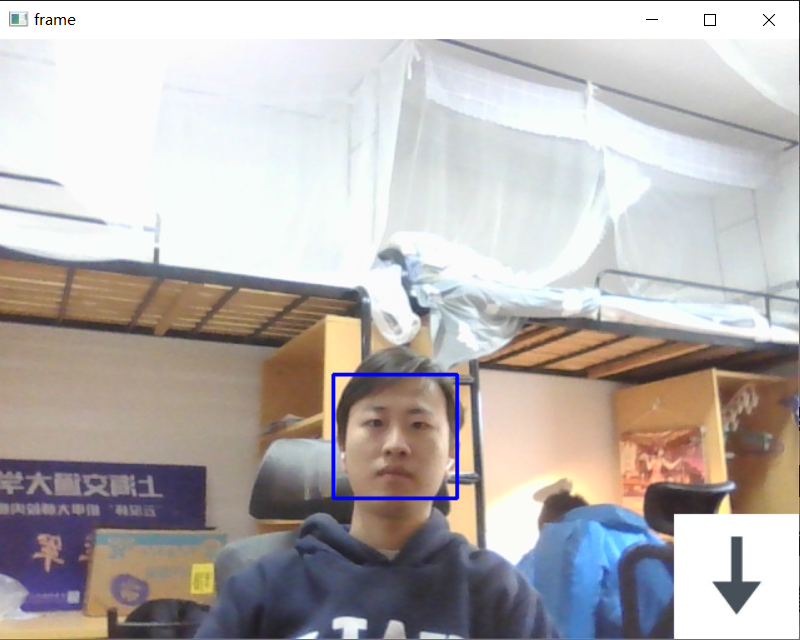
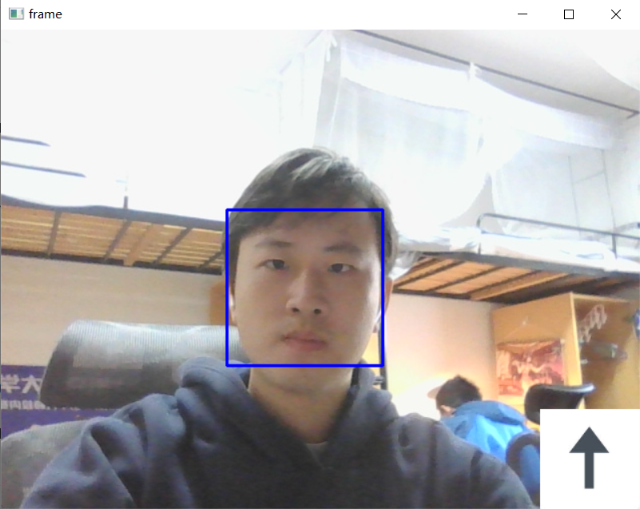
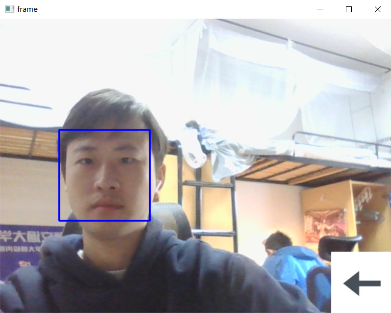
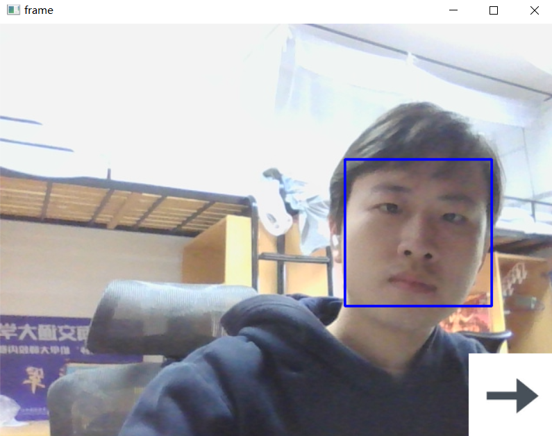

# Assignment 1
> Use nested loop to set the tiger's head to the left upper corner in a 3 * 3 matrix, and each has a green rectangular frame.
## Rendering
  

# Assignment 2
> Use opencv+python to control my integrated camera, and recognize my face position to generate a position marker on the left-bottom of the pic.
## Rendering

# Assignment 3
>

