# Assignment 1
> Use nested loop to set the tiger's head to the left upper corner in a 3 * 3 matrix, and each has a green rectangular frame.
## Rendering
  

# Assignment 2
> Use opencv+python to control my integrated camera, and recognize my face position to generate a position marker on the left-bottom of the pic.
## Rendering
### Noface

### Hold

### Backward

### Forward

### Left

### Right

# Assignment 3
> Use opencv+python to control my integrated camera, and recognize my face position to generate a position marker in minecraft.
## Rendering
### Standby
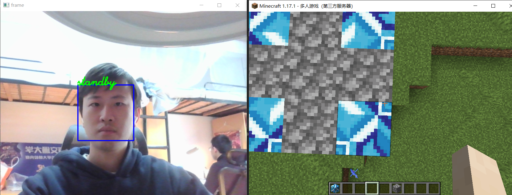
### Up
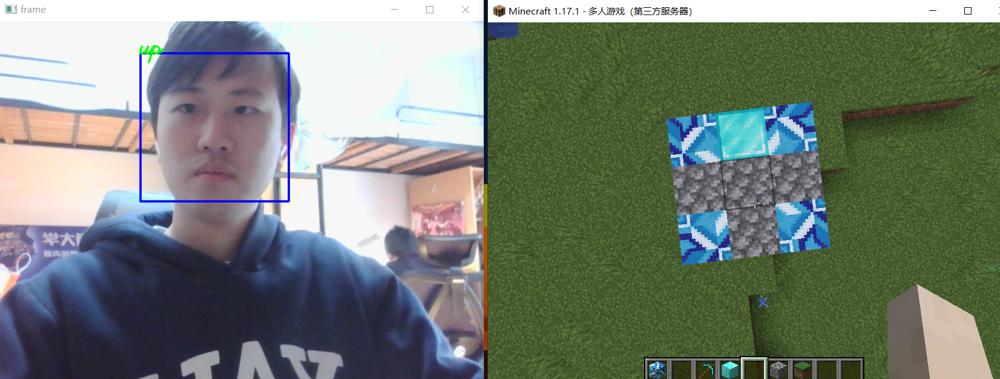
### Down
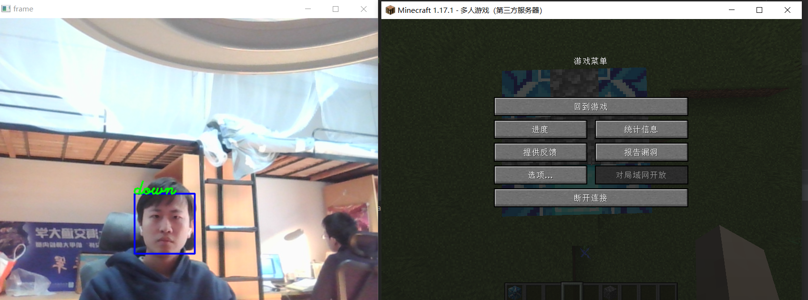
### Left
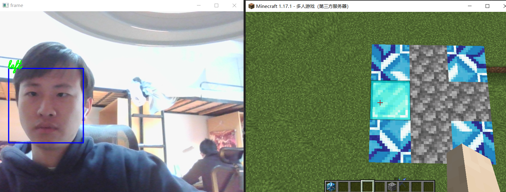
### Right
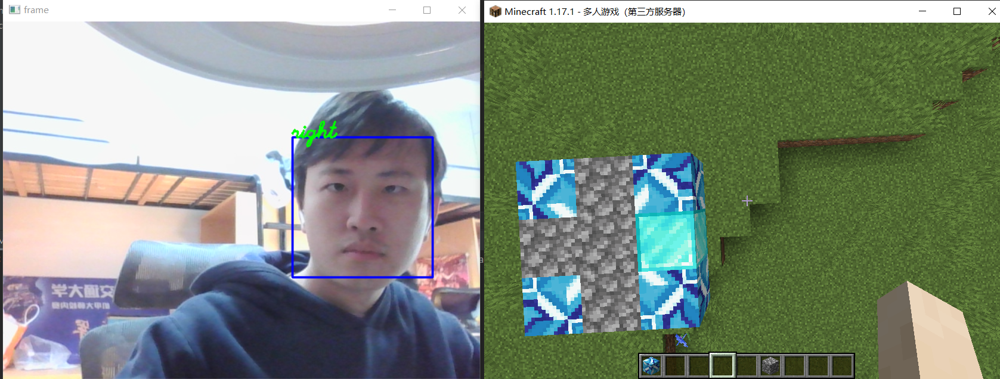

# Assignment 4
>Use mediapipe & keyboardmimic to control movement in minecraft.
## Rendering
### Go Backward
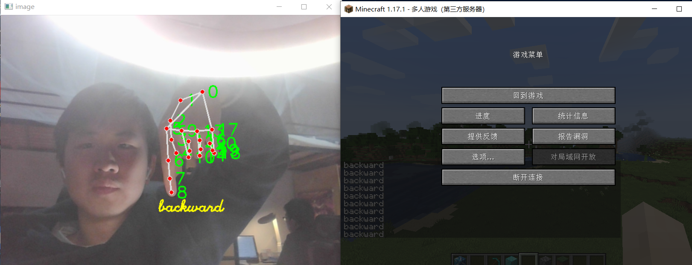
### Go Forward
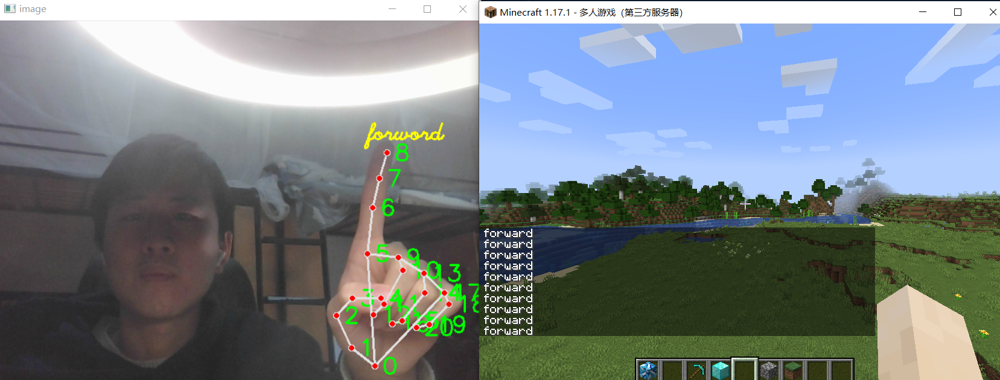
### Turn Left
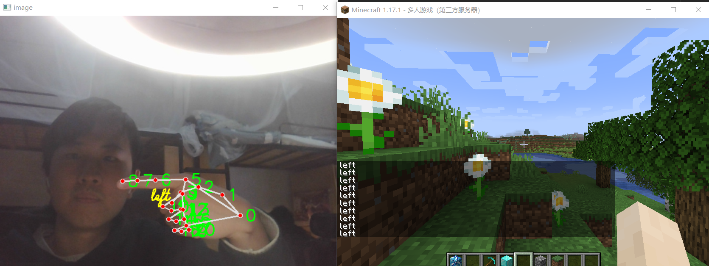
### Turn Right
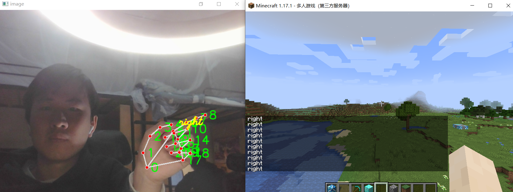

# Assignment 5
## Task 1
>Use openGL to draw 4 bulbs, connect them to COM13, and receive signal from face-detection.
## Rendering
### Up
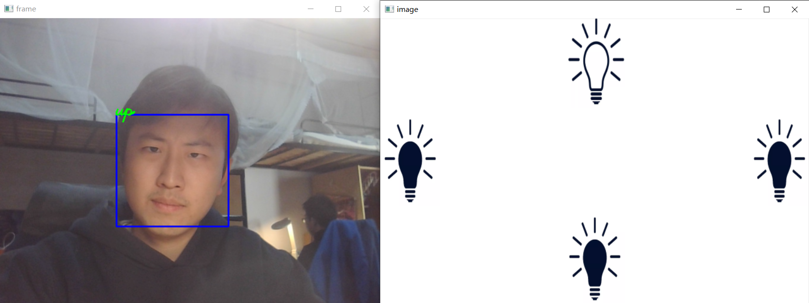
### Down
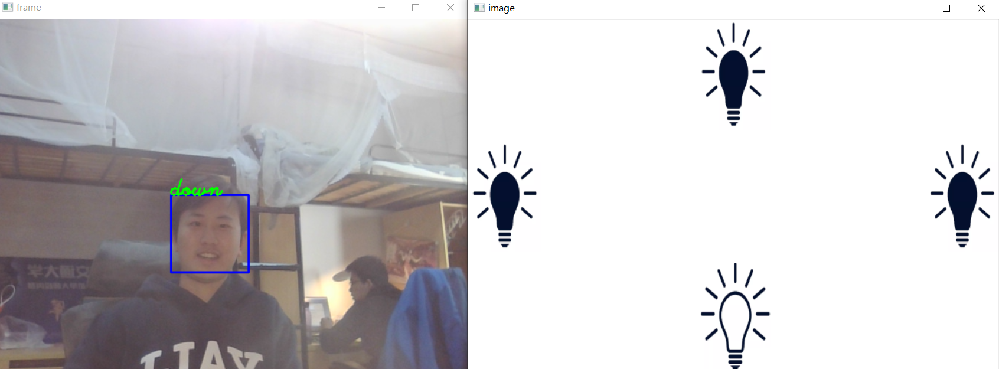
### Left
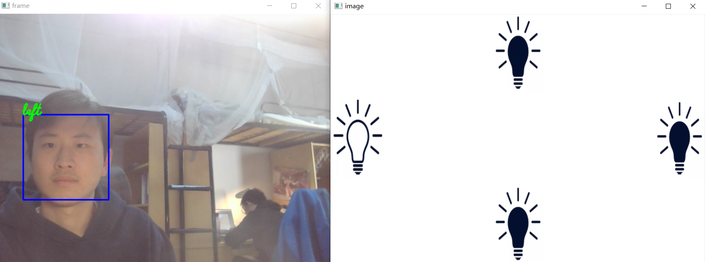
### Right
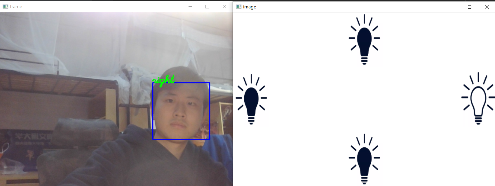

## Task 2

