# 李治璋 519021910171
## 第一次作业
原图
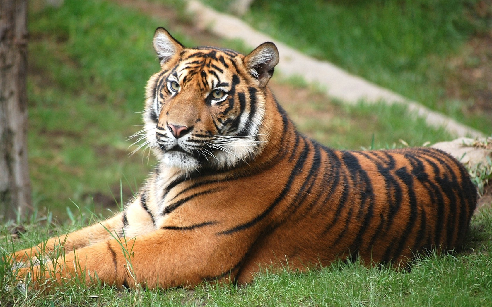

效果图
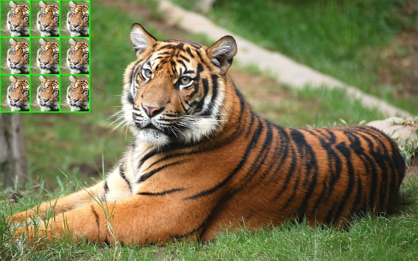

源代码如下，详见[test1.ipynb](./test1.ipynb)
```
import cv2
img=cv2.imread("cats.jpeg")

t=img[100:600,400:800].copy()
print(t.shape)
q=cv2.resize(t,(120,150))
print(q.shape)

for i in range(0,3):
    for j in range(0,3):
        img[0+150*i:150+150*i,0+120*j:120+120*j]=q
        cv2.rectangle(img,(0+120*j,0+150*i),(120+120*j,150+150*i),(0,255,0),3)

img=cv2.resize(img,(168*5,105*5))
cv2.imshow("Cats",img)
cv2.imwrite('tiger1.jpeg',img)
cv2.waitKey(0)
cv2.destroyAllWindows()
```

## 第二次作业
人脸控制小车
前后左右分别如下图所示

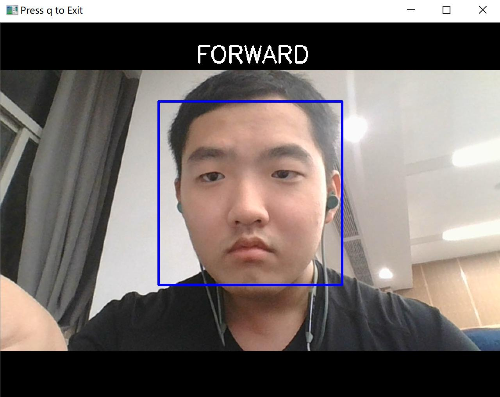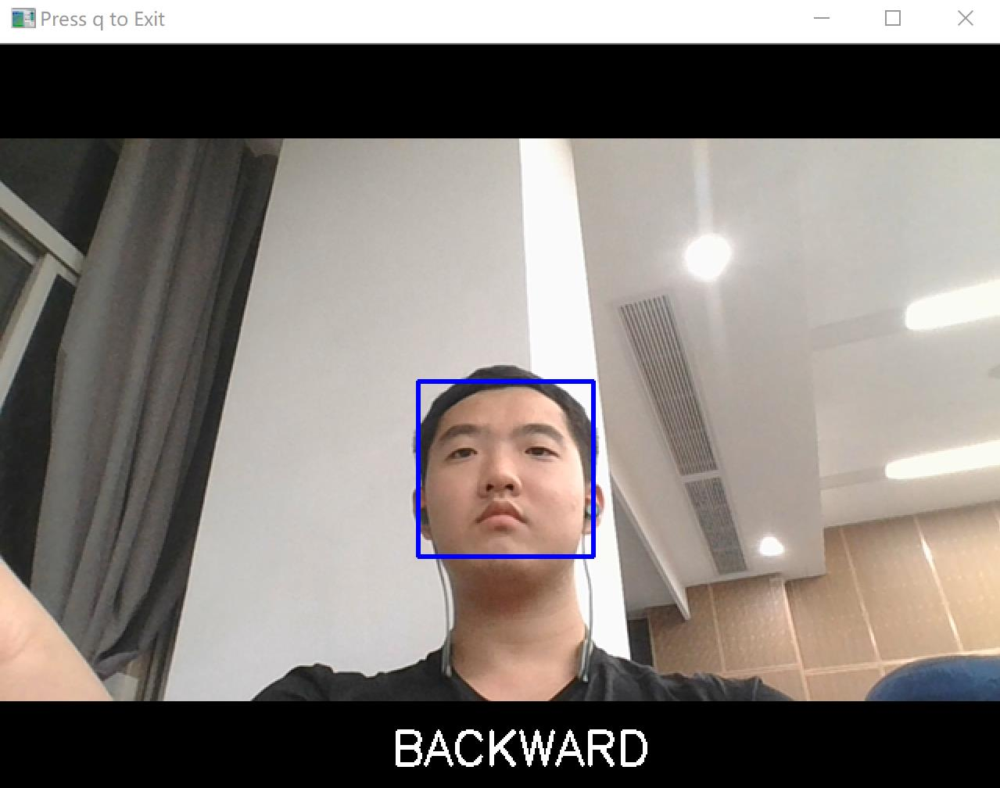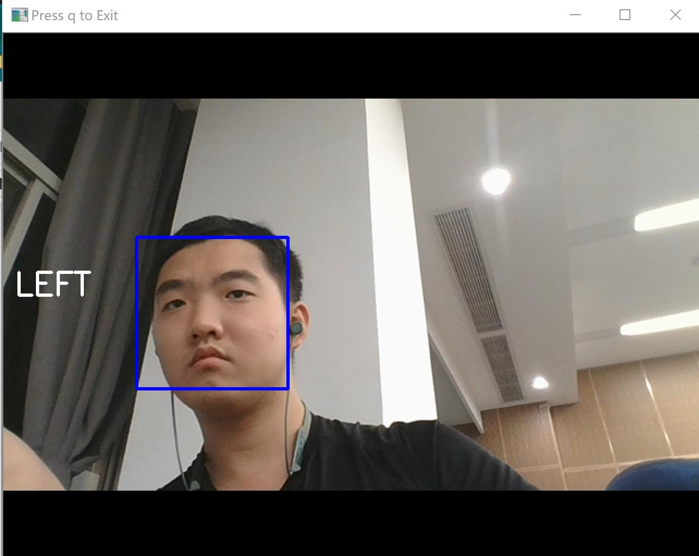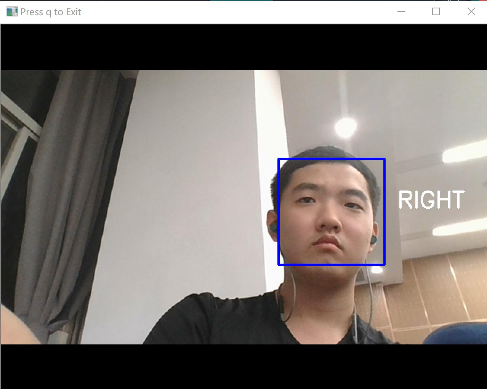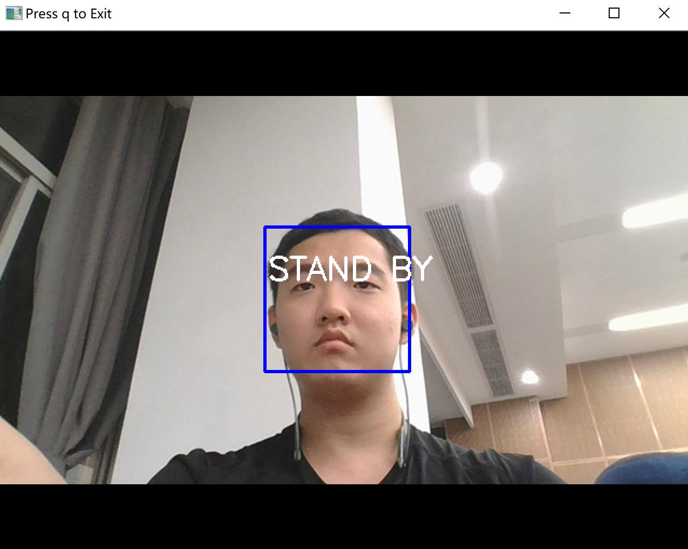

源代码如下，详见[test2.ipynb](./test2.ipynb)最后一段代码Homework2
```
import numpy as np
import cv2
face_cascade = cv2.CascadeClassifier('haarcascade_frontalface_default.xml')
eye_cascade = cv2.CascadeClassifier('haarcascade_eye.xml')
cap = cv2.VideoCapture(0)
print(cap.isOpened())
print(str(cap.get(3))+'\t'+str(cap.get(4)))
cap.set(3,640)
cap.set(4,480)
while(True):
    ret, frame = cap.read()
    frame = cv2.flip(frame,1)
    gray = cv2.cvtColor(frame, cv2.COLOR_BGR2GRAY)
    faces = face_cascade.detectMultiScale(gray, 1.3, 5)
    for (x,y,w,h) in faces:
        frame = cv2.rectangle(frame,(x,y),(x+w,y+h),(255,0,0),2)
        roi_gray = gray[y:y+h, x:x+w]
        roi_color = frame[y:y+h, x:x+w]
    mid_x = x + w/2
    mid_y = y + h/2
    if mid_x < 250 :
        cv2.putText(frame,'LEFT',(10,240),cv2.FONT_HERSHEY_SIMPLEX,1,(255,255,255),2)
    elif mid_x > 390 :
        cv2.putText(frame,'RIGHT',(520,240),cv2.FONT_HERSHEY_SIMPLEX,1,(255,255,255),2)
    else :
        if w > 230 and h > 230:
            cv2.putText(frame,'FORWARD',(250,50),cv2.FONT_HERSHEY_SIMPLEX,1,(255,255,255),2)
        elif w < 120 and h <120:
            cv2.putText(frame,'BACKWARD',(250,460),cv2.FONT_HERSHEY_SIMPLEX,1,(255,255,255),2)
        else :
            cv2.putText(frame,'STAND BY',(250,230),cv2.FONT_HERSHEY_SIMPLEX,1,(255,255,255),2)
    cv2.imshow('Press q to Exit',frame)
    
    if cv2.waitKey(300) & 0xFF == ord('q'):
        break

cap.release()
cv2.destroyAllWindows()
```

## 第三次作业
挑战3：找一个灯泡的图片，用opencv画上下左右4个灯泡。连接到com13上作为命令接收方。 人脸检测作为发送方。 制作一个仿真的人脸识别通过串口控制上下左右4盏灯的仿真系统。 

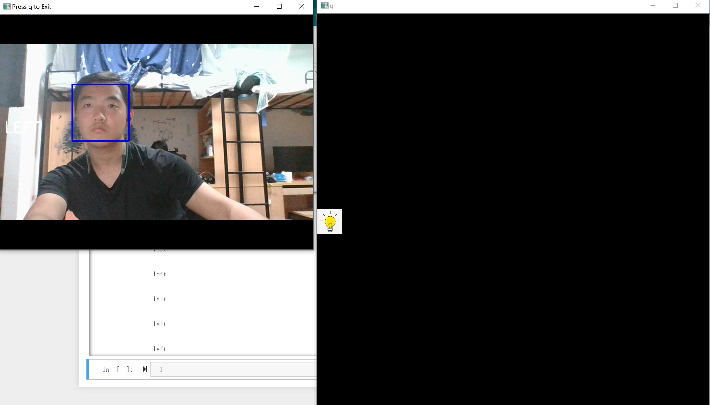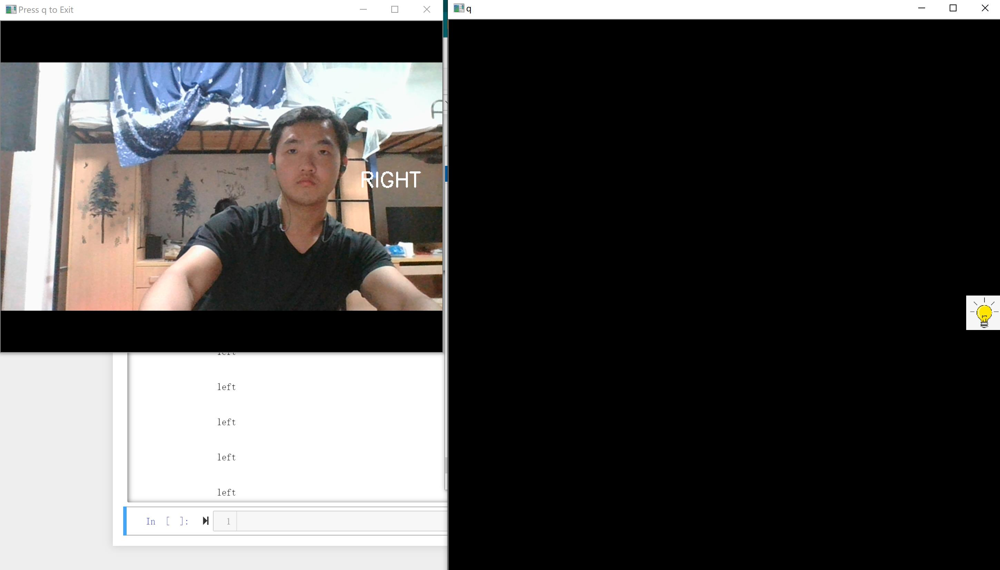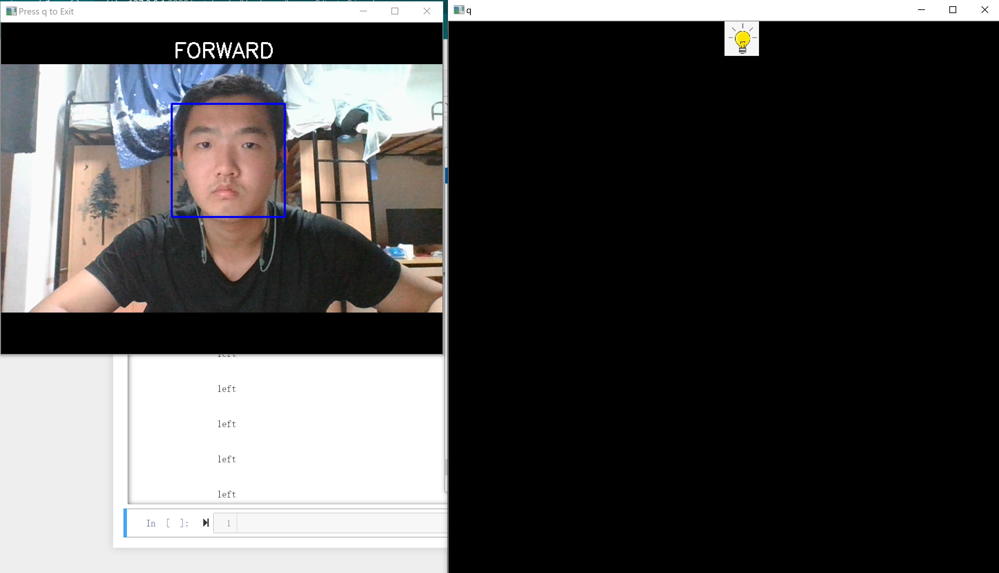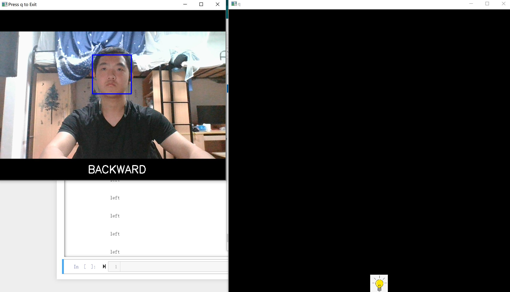

源代码详见[lzz_receive.ipynb](./HW3/lzz_receive.ipynb)与[lzz_transmit.ipynb](./HW3/lzz_transmit.ipynb)
